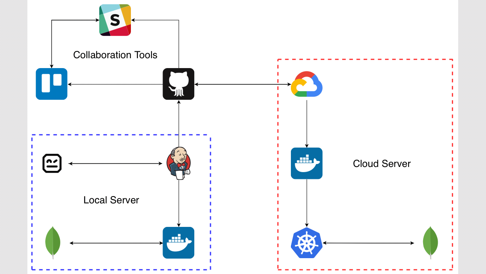
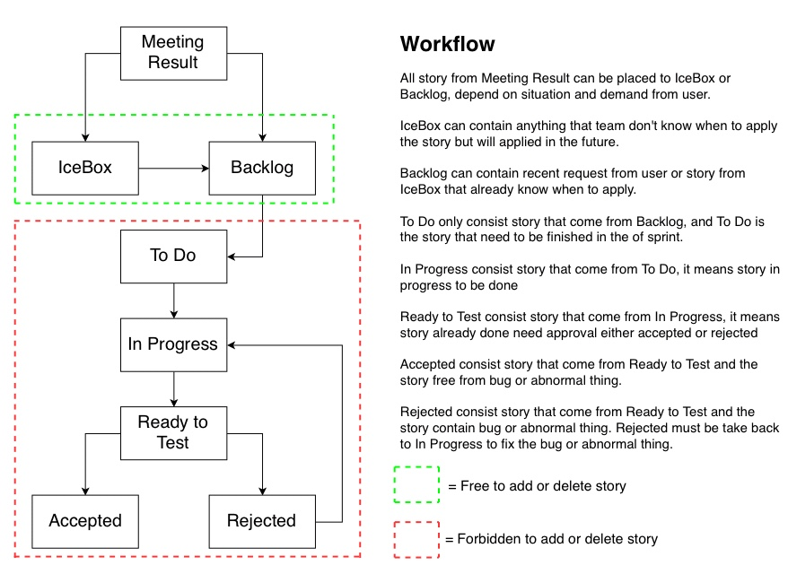

## Current Portofolios
- [**Terracise**](https://rienswinoto.github.io/Terracise/) 

  Terraform exercise using Cloud Computing Service. Develop as much as possible from various Cloud Provider.

- [**PytomationMail**](https://rienswinoto.github.io/PytomationMail/)

  Simple Email Broadcaster with simple adjustment for custom usage.

  Work well for DevOps Engineer that need to report to Developers and QA when finish running a CI/CD.

  Work well too for Administrator that need to broadcast information to some people frequently and need fast reaction.

## Developed

>Currently that is my **monolithic CI/CD** design so far, one day will develop for microservices CI/CD.


>I have modified workflow for team, that using the combination from **Kanban and Scrum**.

What I have used to do development

Kind | Software/Provider/Tool
---- | ----------------------
Chat | Slack
Board | Trello
Version Control System | GitHub
Cloud Computing | Google Cloud Platform
Container | Docker
Container Orchestrator | Google Kubernetes Engine
Load Balancer | Google Cloud Load Balancing
Storage | Google Cloud Storage
Database | MongoDB Atlas
Cloud CI/CD | Google Cloud Build
Local CI/CD | Jenkins
Test Framework | Robot Framework

### Profile
>My name is **Riens Winoto**, graduate of Bina Nusantara University major in **Computer Engineering**. I was born in Binjai, North Sumatra. Currently live in Jakarta. I'm an Introvert, just have a little friends but with strong relationship. Sometimes people don't know me labelling me as an arrogant people but it's no matter, everybody have own opinion. Since my university study, I learn a lot of things start from electrical hardware such as IC chip and components like resistor, transistor, capacitor, sensors. Not only learn about electrical, I learn some programming language too such as C, C++, C Hardware, Assembly Language, VHDL, Matlab, and Java. After graduate from university, **I work at IT StartUp company with position as QA Engineer. Then continue with position as a DevOps Engineer but now with dual job**.

### Skills
#### QA
``` 
Automation Testing 
- Manual Testing 
- Regression Testing 
- Black Box Testing 
- Gray Box Testing 
- Stress Testing 
```

#### DevOps
```
- Cloud Computing 
- CI/CD Docker 
- Kubernetes 
- Automation 
- Scripting 
- Integrate System 
```
